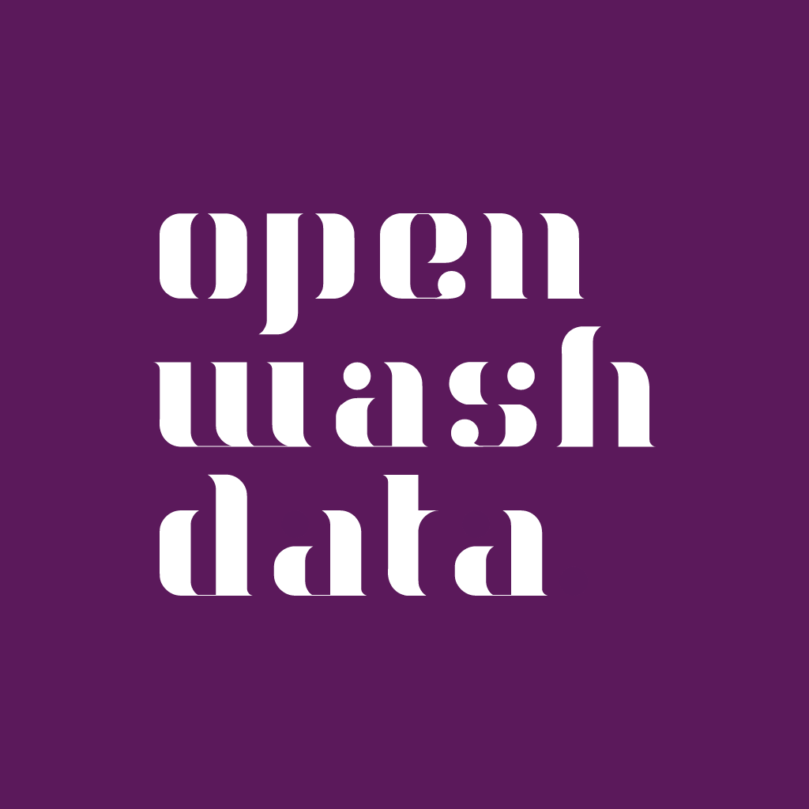
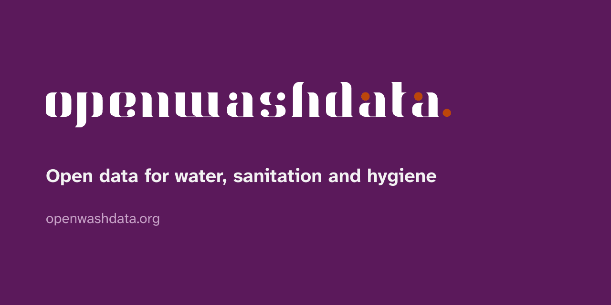

```{r setup}
library(ggplot2)
library(gt)
brand <- brand.yml::read_brand_yml("_brand.yml")
pal <- brand$color$palette
# The R package resolves the Bootstrap aliases to hex values; drop them so
# every tile is a brand token.
pal <- pal[!names(pal) %in% c("purple", "blue", "green", "orange", "red", "yellow", "pink")]
# The R package stores palette names in snake case (owd_purple); accept the
# YAML spelling (owd-purple) and the role names (primary) alike.
hex <- function(name) {
  key <- gsub("-", "_", name)
  if (!is.null(pal[[key]])) return(pal[[key]])
  brand.yml::brand_color_pluck(brand, name)
}
lum <- function(h) {
  v <- grDevices::col2rgb(h)[, 1] / 255
  f <- function(c) ifelse(c <= 0.03928, c / 12.92, ((c + 0.055) / 1.055)^2.4)
  sum(c(0.2126, 0.7152, 0.0722) * f(v))
}
ratio <- function(a, b) {
  la <- lum(a); lb <- lum(b)
  round((max(la, lb) + 0.05) / (min(la, lb) + 0.05), 2)
}
verdict <- function(r) ifelse(r >= 7, "AAA", ifelse(r >= 4.5, "AA", ifelse(r >= 3, "large text only", "fail")))
```

This page renders with the brand files in this repository and nothing
else: no custom SCSS, no manual colours. Everything on it, the swatches,
the contrast table, the themed chart and table, is computed from
`_brand.yml` at render time, so it cannot drift from the definition. Use
the toggle in the navigation bar to see the dark brand.

## Typography

Body text runs in Atkinson Hyperlegible Next, a typeface designed for
legibility at small sizes and for readers with low vision. Headings use
its bold weight in the primary colour. Here is a
[link in the brand blue](https://openwashdata.org), some **bold text**,
some *italic text*, and inline code like `read_csv("data.csv")` in
Source Code Pro on the light purple tint.

```r
# Code blocks use Source Code Pro on the same tint.
library(washr)
setup_dictionary()
```

### A third-level heading

> A block quote, for measuring how quoted material sits against the
> background.

## The palette

```{r}
#| fig-width: 9
#| fig-height: 3.6
#| fig-alt: "Colour swatches of the openwashdata palette, one tile per named colour with its hex value."
df <- data.frame(name = gsub("_", "-", names(pal)), hex = unlist(pal), x = seq_along(pal))
ggplot(df, aes(x = x, y = 1, fill = hex)) +
  geom_tile(color = "white", linewidth = 2) +
  geom_text(aes(label = paste0(name, "\n", hex)),
            angle = 90, size = 3, lineheight = 0.95,
            color = ifelse(vapply(df$hex, lum, numeric(1)) > 0.3, hex("ink"), "#ffffff")) +
  scale_fill_identity() +
  theme_void()
```

### Roles

Each role has a light and a dark value. Tools read the roles, not the
palette names, so a role change reaches every consumer at once.

| Role | Light | Dark | Used for |
|---|---|---|---|
| foreground | ink | paper | text |
| background | paper | owd-purple-dark | page |
| primary | owd-purple | owd-purple-light | navbar, headings, buttons |
| secondary | owd-grey | owd-grey-light | muted text, disabled states |
| tertiary | owd-purple-bg | owd-purple-dim | wells, hover states, code background |
| success | owd-green | mint | tip callouts, positive states |
| info | owd-blue | owd-blue-light | links, note callouts, info states |
| warning | owd-orange | peach | warning and caution callouts |
| danger | owd-red | rose | important callouts, errors |

### Pairings and contrast

Text needs a contrast of 4.5:1 against its background (WCAG AA), large
text and interface elements 3:1. The table is computed from the file.
The four highlight colours (mint, peach, sand, rose) are backgrounds
only and take ink text; they are not for text.

```{r}
pairs <- rbind(
  data.frame(text = c("ink", "owd-purple", "owd-blue", "owd-orange", "owd-green", "owd-red", "owd-grey"), on = "paper"),
  data.frame(text = "white", on = c("owd-purple", "owd-blue", "owd-orange", "owd-green", "owd-red", "owd-grey")),
  data.frame(text = "ink", on = c("owd-purple-bg", "mint", "peach", "sand", "rose")),
  data.frame(text = c("paper", "owd-purple-light", "owd-blue-light", "mint", "peach", "rose", "owd-grey-light"), on = "owd-purple-dark")
)
pairs$ratio <- mapply(function(t, o) ratio(if (t == "white") "#ffffff" else hex(t), hex(o)), pairs$text, pairs$on)
pairs$verdict <- verdict(pairs$ratio)
pairs |>
  gt() |>
  cols_label(text = "Text", on = "Background", ratio = "Contrast", verdict = "WCAG") |>
  tab_options(table.font.size = px(14)) |>
  brand.yml::theme_brand_gt(brand = brand)
```

## Semantic roles in callouts

::: {.callout-note}
A note, tinted from `info` on the web and from `primary` in Typst.
:::

::: {.callout-tip}
A tip, tinted from `success` (owd-green).
:::

::: {.callout-warning}
A warning, tinted from `warning` (owd-orange).
:::

::: {.callout-caution}
A caution, also from `warning`.
:::

::: {.callout-important}
An important callout, tinted from `danger` (owd-red).
:::

## Logos

The wordmark and the stacked mark exist for light and for dark
backgrounds. `_brand.yml` designates three sizes with a light and a dark
variant each; Quarto and bslib pick the right one for the mode.

::: {layout-ncol="2"}
{width="260"}

{width="90"}
:::

::: {style="background: #2d0e2d; padding: 1.5rem; border-radius: 6px;"}
::: {layout-ncol="2"}
{width="260"}

{width="90"}
:::
:::

### Rules

- **Which variant.** Wordmark (01 to 12) beside text and in headers;
  stacked mark (13 to 34) where the space is square; badge (35 to 41)
  for avatars and favicons. Black or white artwork on coloured
  backgrounds; the coloured artwork (purple, light purple, orange) on
  white or paper only.
- **Dark backgrounds.** Use the white variants (04 to 06, 13 to 17) or a
  badge. Never place the black wordmark on owd-purple.
- **Clear space.** Keep at least the height of the lowercase letters
  free around the mark. Minimum width 120 px or 30 mm for the wordmark,
  24 px for the stacked mark.
- **No changes.** Do not recolour, stretch, outline or add effects. The
  dot is part of the mark.
- **Navbar note.** A Quarto or pkgdown navbar in the primary colour
  needs the white stacked mark; set it explicitly
  (`navbar: logo: logos/OWD-logo-16.png`) until the tools pick a logo by
  background.
- **Permission.** The logos identify openwashdata. They are here so that
  openwashdata material renders with the right marks; any other use
  needs permission (see the LICENSE section of the README).

The full library sits in `logos/`: 41 variants as SVG and PNG, a large
export of variant 20, and the QR code logos in `logos/communications/`.

## Dark mode

The dark brand lives in `_brand-dark.yml`: the same palette and logos,
dark values for the roles. A Quarto website toggles between the two:

```yaml
brand:
  light: _brand.yml
  dark: _brand-dark.yml
format:
  html:
    theme:
      light: brand
      dark: brand
```

Typst PDFs and revealjs slides render one mode; set `brand-mode: dark`
for the dark one. The brand.yml R package that bslib and pkgdown use
reads one mode per file, which is why the two brands stay in two files.

## Charts and tables

The brand.yml R package themes ggplot2, gt, flextable, plotly and
thematic from the file, so a chart in a data package README or a course
slide carries the brand without manual colours.

```{r}
#| fig-width: 8
#| fig-height: 4
#| fig-alt: "Bar chart of monthly household water costs in three Accra neighbourhoods, in brand colours."
costs <- data.frame(
  neighbourhood = c("Madina", "Nima", "Teshie"),
  cost = c(48.5, 61.0, 39.2)
)
ggplot(costs, aes(x = neighbourhood, y = cost, fill = neighbourhood)) +
  geom_col(width = 0.6) +
  scale_fill_manual(values = c(hex("owd-purple"), hex("owd-orange"), hex("owd-green")), guide = "none") +
  labs(x = NULL, y = "Median monthly cost (GHS)", title = "Household water costs, Accra 2023") +
  brand.yml::theme_brand_ggplot2(brand = brand)
```

```{r}
costs |>
  gt() |>
  cols_label(neighbourhood = "Neighbourhood", cost = "Median monthly cost (GHS)") |>
  brand.yml::theme_brand_gt(brand = brand)
```

The two calls are `brand.yml::theme_brand_ggplot2()` and
`brand.yml::theme_brand_gt()`. In R the palette names carry underscores
(`brand$color$palette$owd_purple`). For categorical series use the palette in
this order: owd-purple, owd-orange, owd-green, owd-blue, owd-purple-light,
owd-grey. For a sequential ramp interpolate from owd-purple-bg to
owd-purple-dark.

## Assets

Ready to upload: a square avatar for GitHub, Buttondown and LinkedIn,
and a social preview image for repositories and the website. Both are
generated from the logo files with Typst (`assets/*.typ`).

::: {layout-ncol="2"}
{width="200"}

{width="400"}
:::

## How to use the brand

- **Quarto** website, document or slide deck: `quarto use brand openwashdata/brand` (Quarto 1.9 and later), or copy `_brand.yml` and `logos/` into the project root.
- **Branded PDF and Word documents:** the [quarto-owd](https://github.com/openwashdata/quarto-owd) extension, formats `owd-typst` and `owd-docx`.
- **R data packages:** `washr::use_brand()` copies the brand and wires the pkgdown site.
- **Shiny and other bslib apps:** `bslib::bs_theme(brand = "_brand.yml")`.
- **Charts and tables:** the `theme_brand_*()` functions above.
- **Everything else:** read the YAML and take colours from `color$palette`.

Values change in this repository first. Consumers refresh with the same
commands; releases are tagged, so a consumer can pin a version
(`washr::use_brand(ref = "v1.0.0")`).
